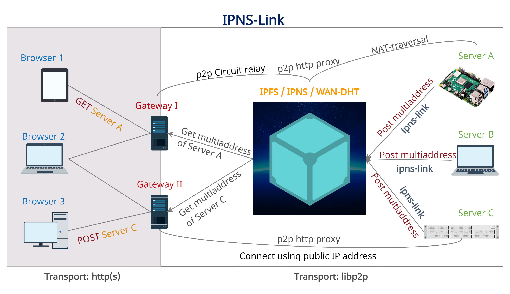

# IPNS-Link

[One can add a static website to IPFS and address it using IPNS](https://medium.com/pinata/how-to-easily-host-a-website-on-ipfs-9d842b5d6a01). The website can then be accessed through any IPFS gateway. But what about a dynamic website or web app that needs to run server-side code! **IPNS-Link** makes it possible to address any http-server using IPNS.

[This page presents a high-level overview. The detailed specs and implementation-intricacies would be documented [elsewhere](/specs.md)].

### A picture is worth a thousand words. So let's start with one:

### In brief, this is how it works:

- Alice runs her website on her device. She [exposes her local server with `ipns-link`](https://github.com/ipns-link/ipns-link/blob/main/tutorials/QuickStart.md) and gets an [IPNS-name or key](https://docs.ipfs.io/concepts/ipns/) that she can then distribute to her users/website-visitors.
- Bob puts Alice's IPNS key in any [IPFS](https://ipfs.github.io/public-gateway-checker/) or [IPNS-Link](https://github.com/ipns-link/ipns-link-gateway) gateway in his browser. The gateway finds the [multiaddress](https://docs.libp2p.io/concepts/addressing/) of Alice's node from her IPNS record. It then establishes a persistent connection with her node and [proxies](https://github.com/ipfs/go-ipfs/blob/master/docs/experimental-features.md#p2p-http-proxy) for her server, delivering her website to Bob. Note that Bob can use any gateway, even a [self-hosted](https://github.com/ipns-link/ipns-link-gateway#self-hosting), local one. Alice's website, therefore, practically gets atleast as many URLs as there are public gateways: `http(s)://any.gateway.tld/ipns/AliceKey`.

### IPFS is used basically as a CDN:

- Alice may pin the static contents of her website, such as images, media, css and javascripts, with an [IPFS cluster](https://cluster.ipfs.io/) or pinning-services such as [Pinata](https://www.pinata.cloud/).
- Requests for those static contents from Bob's browser are served from IPFS. Only the requests for dynamic contents need ever reach Alice's origin-server.

### IPFS also makes streaming efficient:

- Alice creates media and streams live. Her [`ipns-link`](https://github.com/ipns-link/ipns-link) daemon watches her media directory and dynamically adds the directory to IPFS whenever new content is added. The resulting [CID hash](https://docs.ipfs.io/concepts/content-addressing/) is published immediately with [IPNS pubsub](https://github.com/ipfs/go-ipfs/blob/master/docs/experimental-features.md#ipns-pubsub).
- Bob and Charlie join the stream using the same gateway. The gateway retrieves the corresponding files from Alice using [bitswap](https://docs.ipfs.io/concepts/bitswap/) and caches with its local IPFS node. Bob and Charlie are then served from the cache. Alice thus has to upload her files only once per gateway, saving her bandwidth.

### Let's look at some more features:

##### No need for domain names or DDNS. The IPNS-Key is enough

- Alice can simply export her libp2p-key-pair into a file, copy the file to another machine and import the keypair there. She can then port her entire website to the new machine and expose its local server with `ipns-link`. Because she is using the same key-pair, her website can still be accessed using the same IPNS-key, although her website is now running on an entirely new machine with perhaps a new public IP address.

- Similarly, a dynamic public IP address doesn't cause any problem either.

##### NAT-traversal

IPFS's built-in [NAT-traversal](https://github.com/ipfs/go-ipfs/blob/master/docs/experimental-features.md#autorelay) helps in cases where there is no public IP at all.

##### Intermittent connectivity

If Alice has intermittent connections, Alice may configure [`ipns-link`](https://github.com/ipns-link/ipns-link/blob/main/MANUAL.md#onfail) such that Bob gets redirected to any URL of her choice, whenever Alice goes offline. The default redirect is to a "coming-soon" page, reassuring Bob that Alice would be back, soon.

##### No need for SSL

The p2p connection between the gateway and Alice's origin-server is [encrypted](https://docs.ipfs.io/concepts/privacy-and-encryption/#encryption). If Bob is using a local gateway on his machine to access Alice's website, then he is completely safe. Otherwise, he can simply use an https-enabled public gateway, such as https://www.ipns.live. Alice doesn't need to purchase and manage SSL certificates on her own anymore to serve securely.

##### Same origin policy

The gateways assign each website its own subdomain.

# FAQs

### But an IPFS gateway such as ipfs.io doesn't support all these features!

True. [IPFS-gateway](https://docs.ipfs.io/concepts/ipfs-gateway/#overview)s are designed to serve static sites only, they can't serve as proxies. Hence, IPNS-Link needs its own gateway. [ipns.live](https://ipns.live) is an example running the [prototype implementation](https://github.com/ipns-link/ipns-link-gateway). **Anyone can host an IPNS-Link-gateway, as the code is free and open-source**.

IPNS-Link-gateways and IPFS gateways, however, complement each other. Whenever Bob puts Alice's IPNS key into an IPFS gateway, it redirects Bob's browser to an IPNS-Link gateway that then connects Bob to Alice's site. On the other hand, an IPNS-Link-gateway redirects almost all requests for static contents to IPFS gateways, in order to offload itself.

### Cool. But why care?

Let's look at the following use cases, then.

##### Censorship resistance

A website (say, `example.com`) that is blocked in a country or region may be accessed easily using IPNS-Link. Because the site already has a domain name, its IPNS key can be conveniently distributed as a [DNSLink](https://docs.ipfs.io/concepts/dnslink/#dnslink). Gateways can automatically resolve DNSLinks. So, alternate URLs for that site would simply look like, `http(s)://gateway.tld/ipns/example.com`.

##### Anonymity

Accessing websites through public gateways masks the user's IP address from the websites visited. [Compare [Tor](https://www.torproject.org/) and [VPN](https://en.wikipedia.org/wiki/Virtual_private_network)]. On the other hand, the origin-server's IP may be hidden from the visitors using an upcoming feature of [`ipns-link`](https://github.com/ipns-link/ipns-link), called **Manifest encryption**.

##### Microhosting

Anyone can host a dynamic website on a Raspberry Pi or an old PC and expose it with IPNS-Link. Costs and hassles are minimal. One no more needs a domain name, (wildcard) SSL certificates, a public (static) IP, or DDNS. The prototype implementation of [`ipns-link`](https://github.com/ipns-link/ipns-link) also makes sure bandwidth consumption is as low as possible.

Mobile devices remain on almost all the time and are good as lightweight servers. With [Termux](https://termux.com/), one can adapt `ipns-link` to android devices.  If most of the website contents is static, then only a few requests would ever reach the origin-server. Also `ipns-link` consumes very little CPU and bandwidth. This saves on battery. Even in face of intermittent connections, visitors may be kept engaged or informed with an appropriate redirect destination for when the server goes offline.

All these might help developers, students, hobbyists and tinkerers host their sites for free - be it for testing, learning, trying or for sheer joy.

##### Livestreams

With multiple gateways at their disposal, each visitor can choose the gateway nearest to them. Since each gateway serves the stream content from its local IPFS cache, this would ensure a faster streaming experience. Also the origin-server is significantly offloaded.

##### Self-hosting your blog comments

You can happily host your static blog by pinning the files to IPFS, publishing the CID with IPNS or DNSLink and serving it through any IPFS gateway, local or public. But what if you need a comment system for your blog? If you are not okay using 3rd party services for hosting your comment system, you can [host your own](https://darekkay.com/blog/static-site-comments/#self-hosted) and expose the http end-point with IPNS-Link.

##### Private network

A giant corporation can build its own [private IPFS network](https://github.com/ipfs/go-ipfs/blob/master/docs/experimental-features.md#private-networks) consisting of its many origin-servers and a few public facing IPNS-Link-gateways to securely reverse proxy for all of those backends.

##### Shared-hosting providers

Shared hosting providers need to assign a UUID and a subdomain to each accountholder. All that is built into IPNS-Link, the IPNS-key being the UUID and every IPNS-Link-gateway being a subdomain gateway. Therefore, shared-hosting providers can readily adopt IPNS-Link.

If all hosting providers use IPNS-Link, this would have the following benefit. Each hosted website, *regardless of the hosting provider*, can be universally addressed by its unique IPNS-key and accessible using all IPNS-Link-gateways. This would make migrating to another hosting provider seamless, while also enabling multiple points of access.

##### VPN

VPN providers may integrate IPNS-Link-gateways with their infrastructure, to provide access to sites exposed only through IPNS.

### Any implementations yet?

Yes, only the prototypes (MVP) though. We welcome the community to jump in and develop better implementations following the [specs](/specs.md). The specs themselves are subject to discussion and improvement. 

Anyways, the prototypes are these ones --

- The command-line app that you expose your local server with: https://github.com/ipns-link/ipns-link

- An easy to host IPNS-Link-Gateway: https://github.com/ipns-link/ipns-link-gateway. Such a gateway is hosted at [ipns.live](https://www.ipns.live).

### How can the community contribute?

Take a look [here](https://github.com/ipns-link/contribute).

### Where can the community discuss, critique or seek help about IPNS-Link freely?

- The Issues or Discussions section of any repository in the [IPNS-Link organization](https://github.com/ipns-link) at GitHub
- Reddit: [r/ipns_link](https://www.reddit.com/r/ipns_link/)
- [discuss.ipfs.io](https://discuss.ipfs.io)

### What influenced IPNS-Link?

[ngrok](https://ngrok.com/), [localhost.run](https://localhost.run/), [uplink](https://getuplink.de/).

### What's ahead?

1. Free .ipns domain names for all websites addressed using IPNS.
2. A search engine for such websites.

### Can I join the IPNS-Link organization?

Contributors may be sent membership invitations for [IPNS-Link's GitHub organization](https://github.com/ipns-link).

